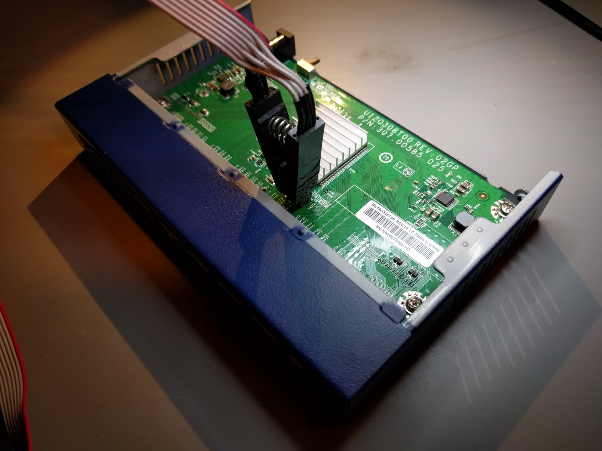

# neatgear

This is a tool for patching the SPI flash contents present on Netgear GS108v4
switches to make them 802.1Q-VLAN-capable. See [this blog post](http://blog.n621.de/2019/04/vlans-on-the-netgear-gs108-switch/)
for technical details.

## Prerequisites

First, you need some way to dump the current flash contents from your switch.
My recommendation is to get a SOIC-8 clip, put
[stm32-vserprog](https://github.com/dword1511/stm32-vserprog) on a
[Bluepill](https://wiki.stm32duino.com/index.php?title=Blue_Pill) board and
then use [Flashrom](https://www.flashrom.org/Flashrom) for reading and writing the flash.

You can of course use any other tool that accomplishes the same goal, but this
will probably give you the best experience for the least amount of money.
Please note that all `flashrom` commands in this document are specific to
`stm32-vserprog` and might need modification if you use some other interface.

## Dumping the flash

**Important:** Make sure the switch is disconnected from it's power supply
before attaching the programmer. Otherwise, the ASIC and the programmer will
interfere when accessing the flash.

Attach the SOIC-8 clip to the flash chip. Make sure the orientation is correct:
Pin 1 of the cable is usually marked in some way, pin 1 of the flash has a
circular indentation on the body of the chip and a dot on the PCB next to the pin.



Then run:

```
flashrom -p serprog:dev=/dev/ttyACM0:115200 -r original.img
```

This should give you the current contents of the switch's flash. Make sure not
to lose it so that you can revert to the original state if necessary.

## Creating a config

Create a VLAN config file. `example.cfg` provides an example how to do so.

## Generate a new flash image based on that config

Run `./apply.py original.img my-vlan.cfg modified.img`. The tool will print a
table representing the generated VLAN config. Check to make sure it matches
your expectations.

If the tool reports an unknown flash image, please consider creating an
[issue](https://github.com/florolf/neatgear/issues/new) and attach your image file.

## Flash the new image

Flash the new image using `flashrom -p serprog:dev=/dev/ttyACM0:115200 -w modified.img`.

## Test your configuration

Disconnect the programmer and power up the switch. Test your configuration to
make sure it behaves as expected.

If you encounter any problems, feel free to create an issue or send a pull
request. Thanks!
